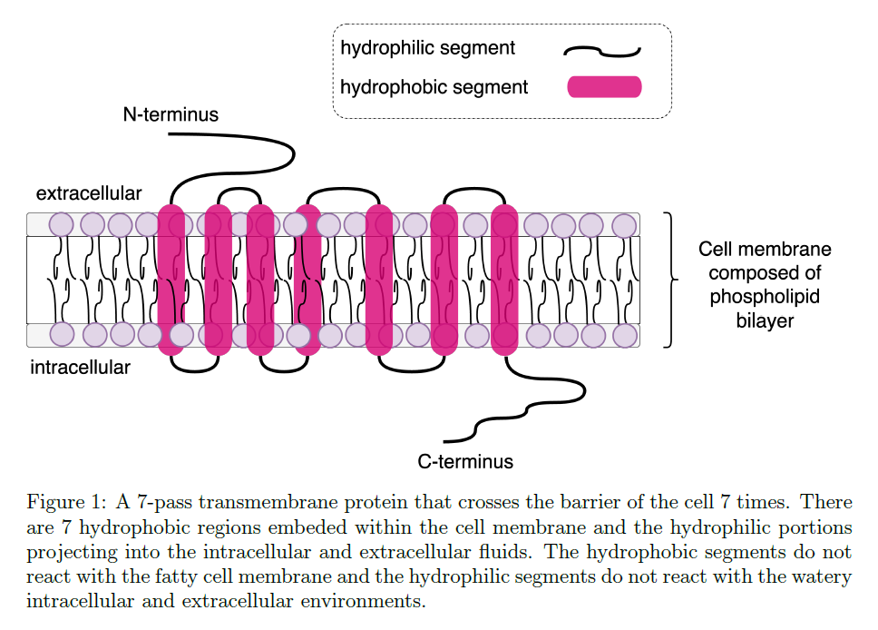
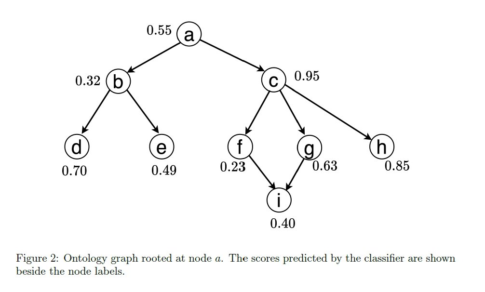

CS-E5875 High-Throughput Bioinformatics  
2026

## Exercise 2: HMMs and gene function

## Viterbi decoding

G-Protein coupled receptors (GPCRs) are a family of 7-pass transmembrane proteins that play vital roles such as light sensing (in the retina of the eye) as well as hormone and neurotransmitter signaling. GPCRs are also involved in the progression of many diseases and are thus a major target for most drugs.




Below, we will use a two-state HMM model to segment a GPCR protein into alternating hydrophobic and hydrophilic regions. We denote the hydrophobic and hydrophilic sections respectively as the **IN** and **OUT** states. You are given a transition matrix \(T\) that characterizes the switches between the 2 states and a frequency table \(F\) showing the counts of each amino acid within each state. Start by transposing \(F\) and convert the frequency table into an emission matrix \(E\).

Transition matrix \(T\):

```text
          IN     OUT
IN      0.8     0.2
OUT    0.05    0.95
```

Frequency table \(F\):

```text
        A   R   N   D   C   Q   E   G   H   I   L   K   M   F   P   S   T   W   Y   V
IN     15  11  10   9  12   8   4  12   8  29  36   8  13  24  15  34  20   1  12  31
OUT    10  16  12   5  17  18   4  12  11  20  45  12  17  20  19  26  20   7   6  15
```

1. **(1.5 points)** Write a code to infer the most probable hidden state sequence that generated a given protein sequence at each position, using the Viterbi decoding algorithm. Assume both states are equally probable at the initial stage. The test sequence to use is an olfactory receptor (responsible for sense of smell) with GenBank accession number: `NP_001001957.2`. This sequence is also available in the `data/` directory provided.  
   Hint: use the base-2 log probabilities to avoid numerical underflow. By mapping the IN and OUT states respectively to 0 and 1, plot the most probable path obtained as a piecewise function with the hidden states on the y-axis and the sequence positions on the x-axis.

2. **(0.5 points)** Score the 3 given sequences using the log probabilities from the Viterbi algorithm in (1). Which of the sequences (`NP_001001957.2`, `NP_149420.4`, `WLF82657.1`) is most likely to have been generated by the 2-state HMM defined above?

3. **(1 point)** Using either the Baum-Welch or Viterbi training algorithm, train a 2-state HMM to infer the optimal transition and emission probability matrices for the sequence in (1). Train the model for 100 iterations and use a tolerance of \(10^{-9}\) for checking for convergence. Assume that both states are equally probable at the initial stage. Compare the initial and the final transition probability matrices. Use the Viterbi function to infer the most likely hidden state sequence that led to the symbols in `NP_001001957.2` based on the trained HMM. Plot the resulting path as a piecewise function and make deductions about the structure of this protein in relation to 7-pass transmembrane proteins.


## Probabilistic modeling of protein families with profile HMMs

A statistical model of a protein family can be created by training a profile HMM on a set of sequences belonging to the family. Novel or previously unannotated proteins can be tested against this model for “likeness” or similarity. You are given a dataset (`data/rats_olfactory_receptors.fasta`) downloaded from the UniProtKB database (`https://www.uniprot.org/`). It consists of GPCR proteins responsible for the sense of smell in rats. Your task is to utilize a profile HMM derived from experimentally-verified members of the family to recognize (potential) new members.

1. **(0.5 points)** Compute a multiple sequence alignment (MSA) of the sequences using the ClustalW heuristic method. Plot the segment of the alignment spanning columns 50 to 165. To avoid cluttering, omit the names and descriptors/identifiers of the sequences in the plot. Are there columns that consist entirely of only one symbol?

2. **(1 point)** Using the `derivePHMM` function in R, generate a profile HMM using the result of the full MSA in (1). Set `pseudocount = "Laplace"`. Using the profile HMM derived, which of the test sequences (`NP_001001957.2`, `NP_149420.4`, `WLF82657.1`) is most likely to be a member of the GPCR family?  
   Hint: Use the log-probability score returned by a Viterbi decoding algorithm to rank the sequences.


## Exploring the gene ontology

In this section, we will use the `goatools` library in python to inspect the gene ontology graph. To assist you, we have provided `Exercise2_go_in_python.py`, a file containing helpful commands for completing this section.

1. **(0.5 points)** What is the total number of functional terms in the file? Toggle the `load_obsolete` flag to `True` and report the number of obsolete functional terms.

2. **(0.5 points)** What is the name given to the term with id `GO:0042710`? On what depth is it located? Which subcategory of the gene ontology does it belong? Plot the lineage chart of the term showing its ancestors and children. Count the number of functional terms containing *ligase* in their textual definition. In all cases, use the set of terms excluding the phased out (obsolete) terms.

3. **(0.5 points)** Plot a bar chart of the number of terms found at each depth of the full ontology, excluding obsolete terms. What does the plot say about the width of the ontology?


## Post-hoc consistency correction of a model’s predictions

Consider the graph in Figure 2 to be the global graph for one of the subcategories (i.e. MF, CC, BP) of the gene ontology. You may assume that a multi-label classifier is trained to predict the functions (i.e. best consistent graph) associated with a protein in a given test set. The classifier achieves this by outputting the respective probabilities for the nodes in the graph. These scores are shown beside each node in the graph below.



1. **(1.5 points)** By leveraging the consistency property of the gene ontology, write a code to enumerate all consistent subgraphs from the given graph. Ideally, the code should work for any directed acyclic graph. Report the total number of consistent subgraphs found. How many of these consist of 7 nodes?

2. **(1.5 points)** If we assume that the classifier ignores the hierarchical dependencies between nodes in the graph, then it is possible that the final predictions (i.e. thresholded scores) will violate the consistency property. Write a code to correct the potential consistency violations in the classifier's predicted graph (Hint: Algorithm 3 in Lecture 4). The algorithm should propagate the scores from the leaf nodes up to the root such that each node retains the maximum score possible based on its descendants. Report the respective final score for each node, after the correction procedure. Using a thresholding function given by \(\mathbb{1}(\hat{\mathbf{y}}\geq 0.5)\), report the nodes in the corrected subgraph.

3. **(1 point)** If the true subgraph associated with a sample protein in a given test set connects nodes \(a, c, f, g,\) and \(i\), plot the precision-recall curves corresponding to the classifier's original predictions (you may name this \(\mathcal{M}_{1}\)) and the consistency correction model’s output (\(\mathcal{M}_{2}\)). Report the area under the curves (AUC) for both models.


